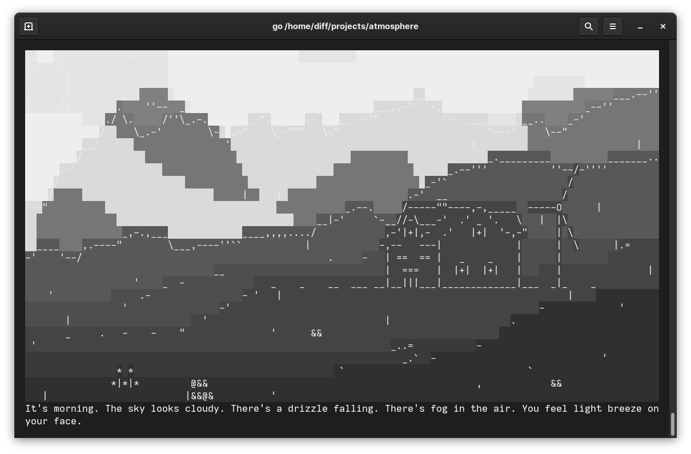

Atmosphere generates dynamic ANSI-powered weather for ASCII landscapes. It's
based on ~iajrz's `climate` program that generates randomized weather prompts.

Using that generated weather, Atmosphere grabs an ASCII landscape and some
specially-made metadata about it and paints weather over the top. Time of day,
cloudiness, fogginess, windiness, and raininess are all supported.

Atmosphere periodically polls for weather changes, and if the weather has been
updated the scene will transition out and back in with the new weather.

## Plans/ideas

Maybe periodically cycle through different scenes, not just when the weather
has been updated? Would also make like "close up" scenes where the sky isn't
visible feasible if it'll just transition out after a few minutes.

## Installation

`go get git.tilde.town/diff/Atmosphere`

## Usage

Just run the compiled executable file.

## Screenshot/Animation

